# RISC-V MYTH Workshop (Microprocessor for You in Thirty Hours)

[](https://www.linux.org/)
[](https://makerchip.com)
[](https://tl-x.org)

This repository contains the complete documentation, lab code, testbenches, simulation waveforms, and hardware models for the **"Microprocessor for You in Thirty Hours" (MYTH)** Workshop, offered by **VLSI System Design (VSD)** and **Redwood EDA**.

---

## 📑 Table of Contents
1. [Course Overview](#-course-overview)
2. [Software to Hardware Transformation Flow](#-software-to-hardware-transformation-flow)
3. [Repository Directory Structure](#-repository-directory-structure)
4. [Day 1: Introduction to RISC-V ISA and GNU Toolchain](#-day-1-introduction-to-risc-v-isa-and-gnu-toolchain)
5. [Day 2: ABI & Basic Verification Flow](#-day-2-abi--basic-verification-flow)
6. [Day 3: Digital Logic with TL-Verilog & Makerchip](#-day-3-digital-logic-with-tl-verilog--makerchip)
7. [Day 4: RISC-V CPU Microarchitecture & Basic Core](#-day-4-risc-v-cpu-microarchitecture--basic-core)
8. [Day 5: Pipelined RISC-V Core & Hazard Resolution](#-day-5-pipelined-risc-v-core--hazard-resolution)
9. [Makerchip Starter Sandboxes & Tools](#-makerchip-starter-sandboxes--tools)
10. [Acknowledgements](#-acknowledgements)

---

## 🔍 Course Overview
The MYTH workshop provides hands-on implementation of a RISC-V microprocessor core from scratch in 5 days (30 hours):
- **Day 1:** Explore the RISC-V ISA, GNU compiler toolchain, C-to-Assembly compilation, and Spike simulation.
- **Day 2:** Understand Application Binary Interface (ABI), system calls, and simulate custom assembly with Picorv32.
- **Day 3:** Master Transaction-Level Verilog (TL-Verilog) and the online Makerchip IDE to build combinational and sequential logic.
- **Day 4:** Design the basic datapath of an RV32I RISC-V CPU (Instruction Fetch, Decode, Register File, ALU).
- **Day 5:** Build a 5-stage pipelined RISC-V core with branch target calculation, data hazards mitigation, and load/store memory operations.

---

## 🔄 Software to Hardware Transformation Flow


1. **Application Software:** High-level code written in C/C++.
2. **Compiler (GCC):** Converts high-level language into RISC-V assembly instructions based on the target ISA specifications (`rv64i` / `rv32i`).
3. **Assembler:** Translates instructions into hex/binary machine code.
4. **RTL Implementation (TL-Verilog):** Hardware description implementing the RISC-V microarchitecture specification.
5. **Physical Design (GDSII):** Synthesized netlist placed and routed using open-source EDA flows (e.g. OpenLANE / SkyWater 130nm).

---

## 📂 Repository Directory Structure

```text
riscv-myth-workshop/
├── Day2/                                  # Day 1 & Day 2 C programs, assembly, and testbenches
│   ├── README.md                          # Detailed walkthrough of Day 1 & Day 2 labs
│   ├── Lab1/                              # Basic C compilation & objdump disassembly
│   │   ├── sum1ton.c
│   │   ├── sum1ton_O1.o
│   │   └── sum1ton_Ofast.o
│   ├── Lab2/                              # Number representation (signed vs unsigned arithmetic)
│   │   ├── signhighlow.c
│   │   └── unshighlow.c
│   ├── Lab3/                              # ABI function call testing
│   │   ├── 1to9_custom.c
│   │   └── load.S
│   └── Lab4/                              # Complete Picorv32 simulation testbench
│       ├── 1to9_custom.c
│       ├── load.S
│       ├── picorv32.v
│       ├── riscv.ld
│       ├── rv32im.sh
│       ├── start.S
│       ├── testbench.v
│       └── hex8tohex32.py
│
├── Day3_5/                                # Day 3 to Day 5 TL-Verilog designs & solutions
│   ├── README.md                          # Index and guide for all TL-Verilog designs
│   ├── inverter.tlv                       # CMOS inverter model
│   ├── basicgates.tlv                     # Combinational gates (AND, OR, XOR, NOT)
│   ├── mux.tlv & mux_with_vector.tlv      # 2:1 Multiplexer and vector multiplexers
│   ├── combinational_calculator.tlv       # 4-function combinational calculator
│   ├── pipeline.tlv                       # Pipelining concepts and retiming
│   ├── pythagoras.tlv & pipeline.tlv      # Pipelined distance calculation
│   ├── sequential_calculator.tlv          # Accumulator calculator
│   ├── calculator_singleValueMemory.tlv   # Calculator with memory storage/recall
│   ├── calculator_solutions.tlv           # Complete calculator reference implementation
│   └── risc-v_solutions.tlv               # Complete 5-Stage Pipelined RV32I Processor Core
│
├── Images/                                # Verification outputs, waveforms, and terminal screenshots
├── calculator_shell.tlv                   # Starter shell for calculator labs
├── risc-v_shell.tlv                       # Starter shell for RISC-V labs
├── reference_solutions.tlv                # Master reference solution file
├── student_projects.md                    # Showcase of alumni MYTH CPU cores
└── tlv_lib/                               # Core TL-Verilog libraries & SVG microarchitecture diagram
```

---

## 🚀 Day 1: Introduction to RISC-V ISA and GNU Toolchain

### Lab 1: Compilation with GCC & Disassembly with Objdump
Compile a standard C program (`sum1ton.c`) using both native GCC and the `riscv64-unknown-elf-gcc` cross-compiler:

```bash
# Compile and run natively
gcc sum1ton.c -o sum1ton
./sum1ton

# Cross-compile for RISC-V target with O1 optimization
riscv64-unknown-elf-gcc -O1 -mabi=lp64 -march=rv64i -o sum1ton_O1.o sum1ton.c

# Disassemble with objdump
riscv64-unknown-elf-objdump -d sum1ton_O1.o > sum1ton_O1_d.txt
```

Inspection of the `main` section in the disassembled output confirms instruction structure:

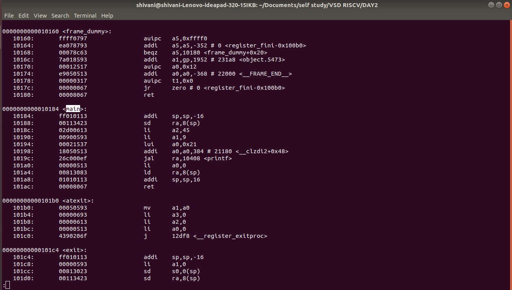

### Spike Simulation & Register Debugging
```bash
# Execute using Spike with proxy kernel (pk)
spike pk sum1ton_O1.o

# Launch Spike in interactive debug mode
spike -d pk sum1ton_O1.o
```

Inspection of register contents (`a0`, `a1`, `a2`) before and after instruction execution:

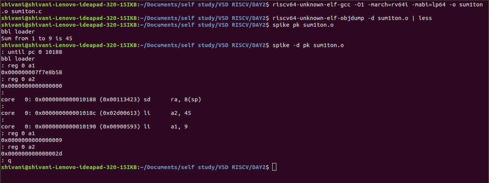

---

## 🛠️ Day 2: ABI & Basic Verification Flow

### Application Binary Interface (ABI) Calling Conventions
The ABI defines how registers are allocated across callers and callees:

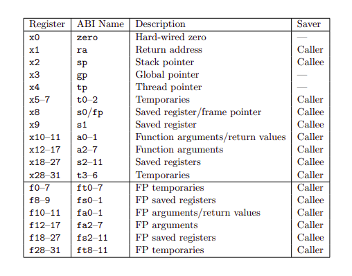

### Lab 3: ABI Function Calls via Custom Assembly
Linking C application code with custom assembly routines (`1to9_custom.c` + `load.S`):

* **Main Function:**
  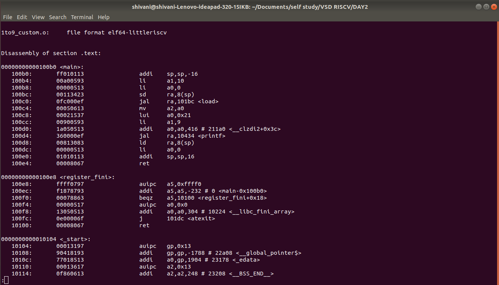

* **Custom Assembly Routine (`load.S`):**
  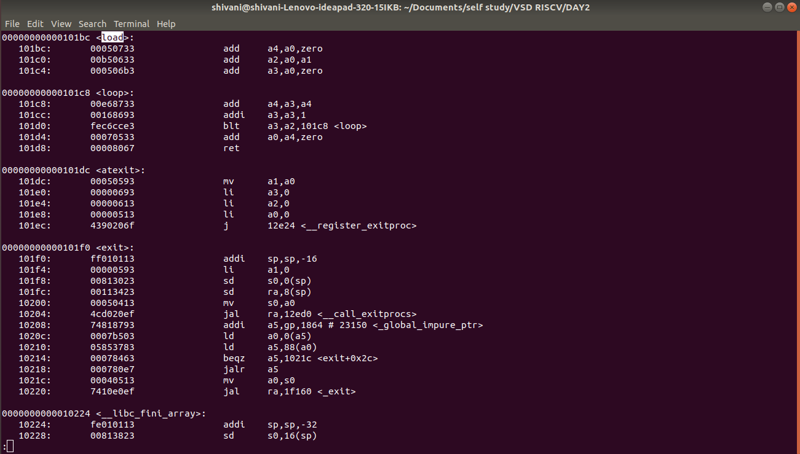

* **Execution Output:**
  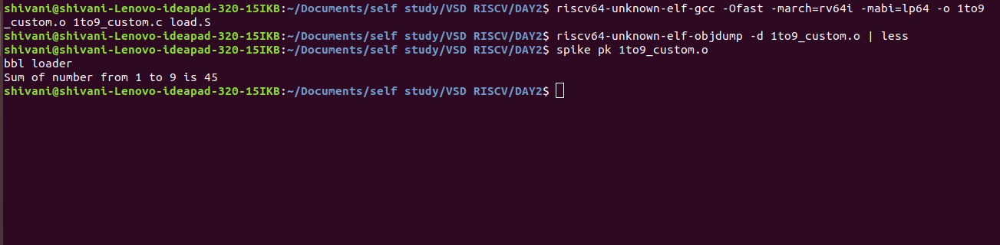

---

## 💡 Day 3: Digital Logic with TL-Verilog & Makerchip

### Combinational Calculator
A 4-operation combinational ALU calculator built in TL-Verilog:
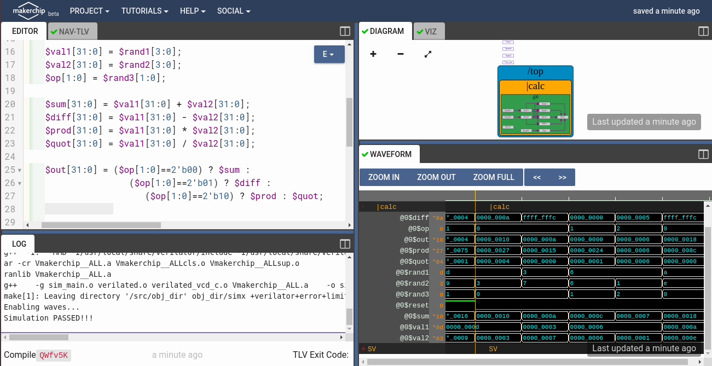

### Sequential Calculator
Sequential accumulator retaining previous output:
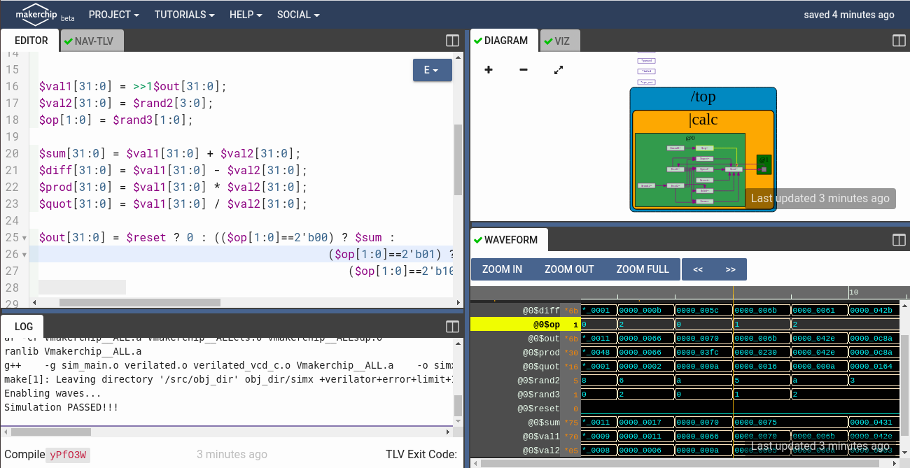

### 2-Cycle Pipelined Calculator
Pipeline timing implementation using `@1` and `@2` stages:
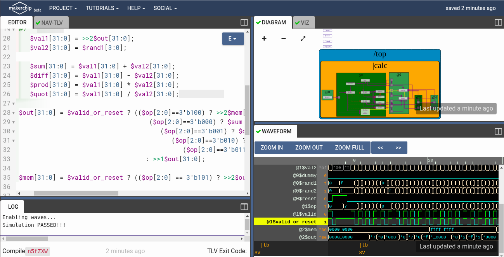

### Cycle Calculator with Validity
Implementing condition-based transaction validity (`?$valid`):
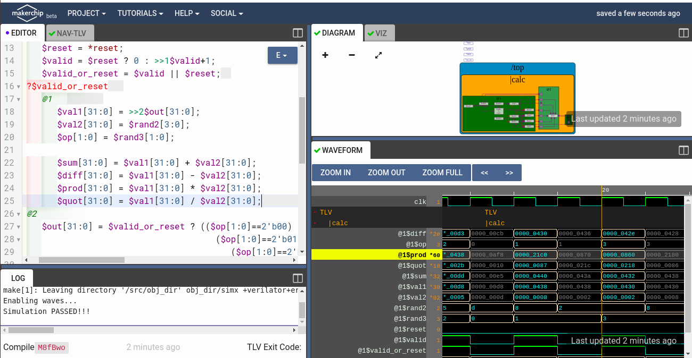

---

## ⚙️ Day 4: Basic RISC-V CPU Microarchitecture

### Instruction Fetch (IF)
Program Counter logic and Instruction Memory interface:
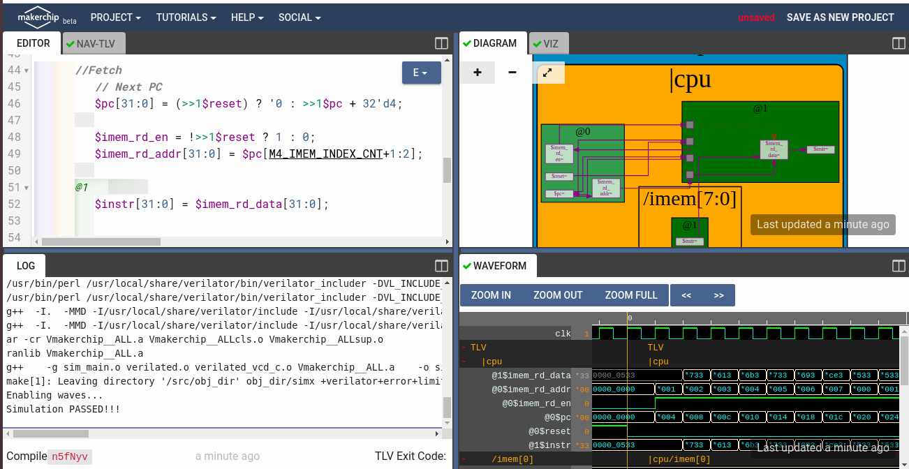

### Instruction Decode (ID)
Decoding R, I, S, B, U, J type instructions and immediate generation:
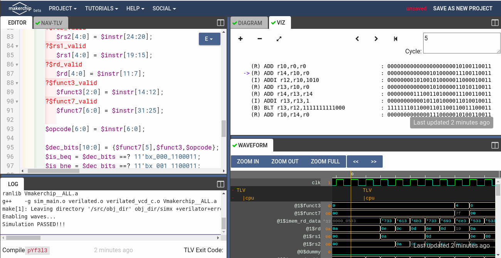

### Register File Read & Write
Dual-read, single-write 32-entry register file:
* **Register File Read:**
  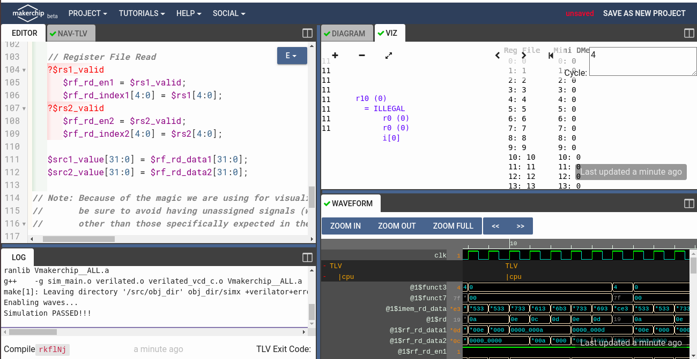
* **Register File Write:**
  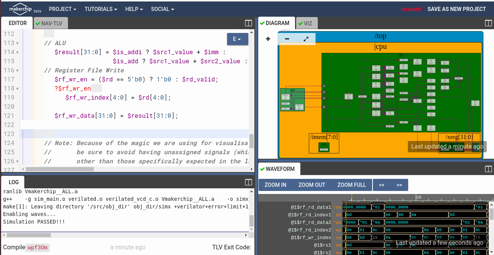

### ALU & Branch Control
Arithmetic Logic Unit and Branch Target calculation:
* **ALU Execution:**
  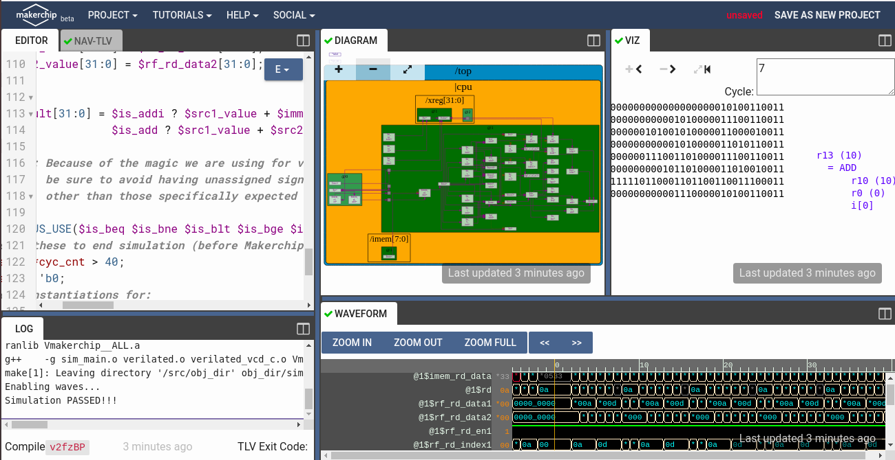
* **Branch Control Logic:**
  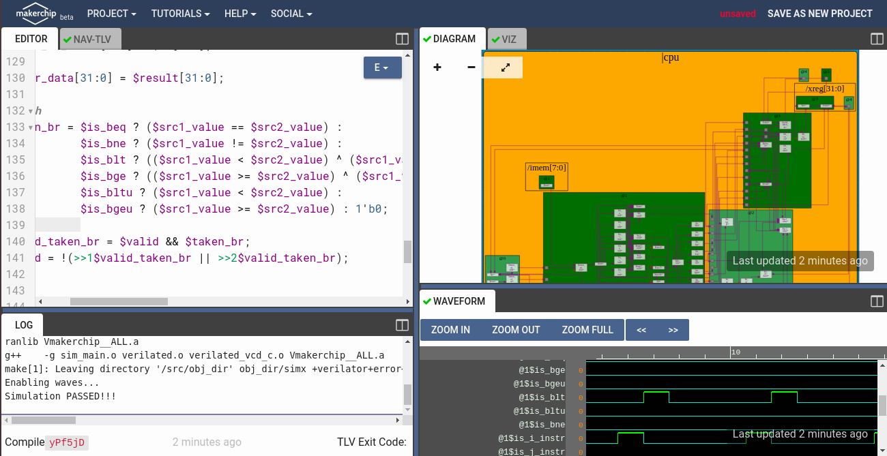

---

## 🏎️ Day 5: Pipelined RISC-V Core & Hazard Resolution

Implemented in [`Day3_5/risc-v_solutions.tlv`](Day3_5/risc-v_solutions.tlv):

### Pipelining the CPU
5-stage pipeline (`@1` Fetch, `@2` Decode, `@3` Execute, `@4` Memory, `@5` Write-Back) with 2-source bypass data forwarding:
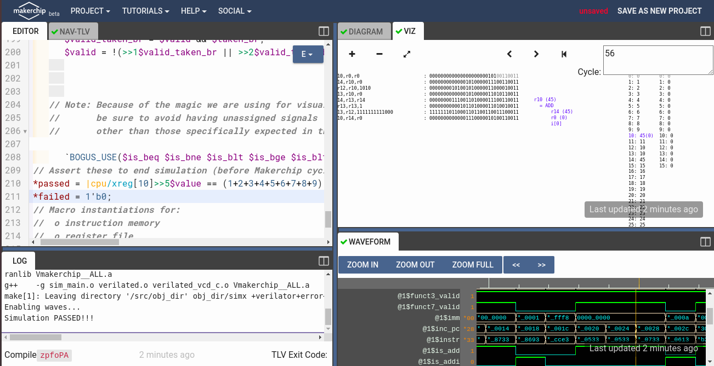

### Load and Store Memory Interface
Data Memory (DMem) read/write interface for `LW` and `SW`:
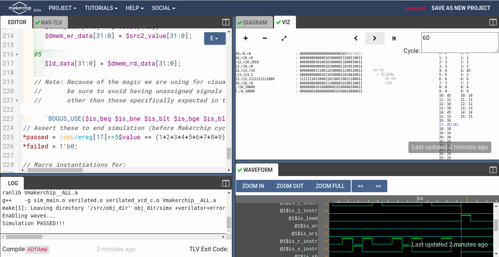

### Final Verification Result
All instructions and the test program (summation of integers 1 to 9 = 45 / `0x2d` in register `x10`) pass successfully:
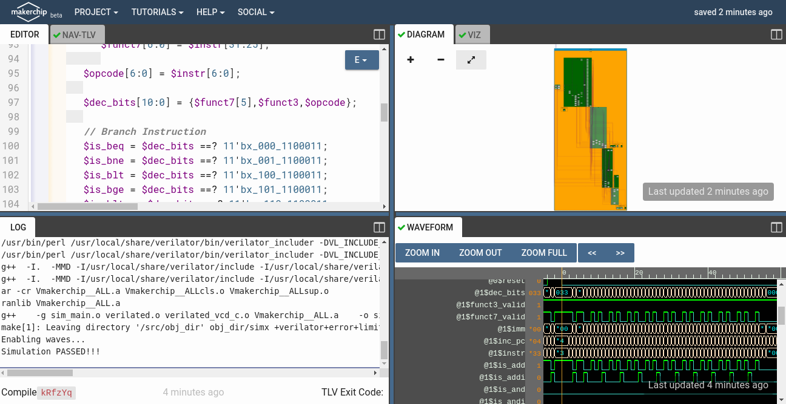

---

## 🔗 Makerchip Starter Sandboxes & Tools
- [Makerchip IDE](https://makerchip.com)
- [Calculator Starter Shell](https://myth.makerchip.com/sandbox?code_url=https:%2F%2Fraw.githubusercontent.com%2Fstevehoover%2FRISC-V_MYTH_Workshop%2Fmaster%2Fcalculator_shell.tlv)
- [RISC-V CPU Starter Shell](https://myth.makerchip.com/sandbox?code_url=https:%2F%2Fraw.githubusercontent.com%2Fstevehoover%2FRISC-V_MYTH_Workshop%2Fmaster%2Frisc-v_shell.tlv)
- [Interactive Reference Solutions](https://myth.makerchip.com/sandbox?code_url=https:%2F%2Fraw.githubusercontent.com%2Fstevehoover%2FRISC-V_MYTH_Workshop%2Fmaster%2Freference_solutions.tlv)

---

## 🤝 Acknowledgements
- **Kunal Ghosh**, Co-founder, VLSI System Design (VSD) Corp. Pvt. Ltd.
- **Steve Hoover**, Founder & CEO, Redwood EDA.
- **Shivam Potdar**, CPU Performance Engineer, Workshop Contributor.
